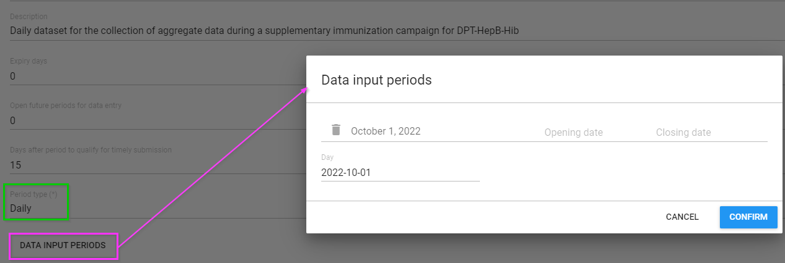
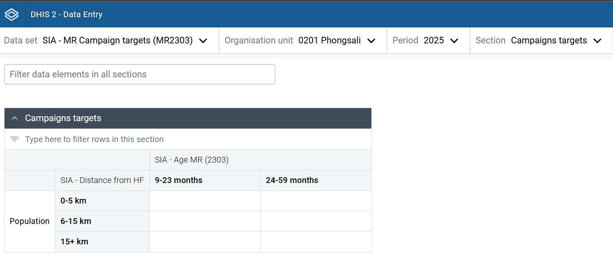
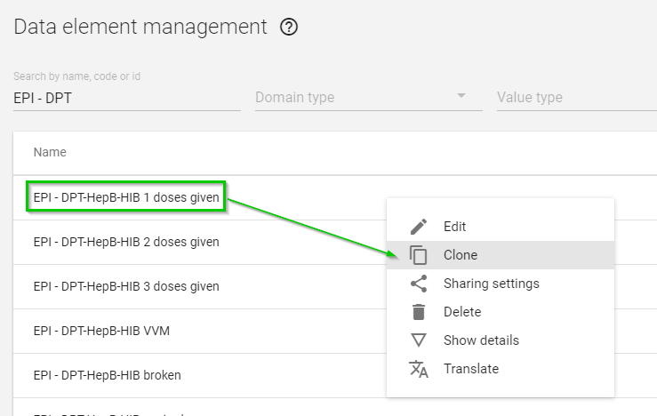
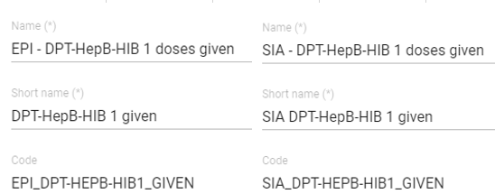

# DHIS2 Design & Configuration Considerations for Health Campaigns

This chapter provides practical tips and good practices for DHIS2 implementers and system designers for the configuration and customization of DHIS2 to support health campaign requirements.

By tracking time-bound and hyperlocal outputs, information systems for campaign monitoring have distinct design characteristics compared to routine systems. However, for interpretation and sustainability, campaign systems must remain aligned with the HMIS, and wherever possible re-use key features provided by the HMIS, such as coverage denominators and administrative geography.

This chapter will break down those key design elements:

* **The Where:** Setting up the org unit hierarchy to support campaign structures & operations and considerations for harmonizing with HMIS org units at an appropriate level of analysis
* **The When:** Configuring campaign targets in DHIS2 and using population estimates and alternative denominators
* **The How:** Harmonization of metadata and integrating campaign outputs into the HMIS

## Org unit hierarchy

The structure of the [organisation Units](https://www.youtube.com/watch?v=UDwmYw0W9gg) (OU) hierarchy and its levels is the most critical design consideration for campaigns. This must be carefully aligned with the planned method of data collection (aggregate or tracker), at what level data will be reported, and at what level indicators will be monitored.

The fundamental technical design challenge is in balancing three competing constraints:

* The HMIS is generally the most reliable and sustainable “source of truth” for health facility hierarchies and locations
* Campaign activities generally occur at sub-facility level at households or communities, or are managed through administrative divisions parallel to HMIS reporting structures
* DHIS2 does not allow for multiple OU hierarchies within a single instance.

As mentioned under **Infrastructure**, it is strongly recommended that large-scale, high-volume health campaigns use dedicated DHIS2 instance. In order to align country systems as close as possible, this campaign instance should first be “seeded” with an import of metadata from the national HMIS. Starting with HMIS metadata saves time, but further, it would provide campaigns with the existing administrative hierarchy, organisation unit groups, indicator types, and existing data elements to prevent duplication with HMIS, thus facilitating analysis and future data integration.

From there, the approach for how to handle organisation units **will depend on the degree to which your requirements for campaign reporting differ from the HMIS**.

#### Assessment of HMIS hierarchy and facility locations

Health facility hierarchies can number in the tens of thousands of org units, and can be challenging to maintain over time. Sometimes, org unit hierarchies suffer from poor data quality due to inconsistent maintenance. Facilities may open, close or move without notice; local government boundaries can be redrawn. Commitment to SoPs for routine organisation unit management are essential. Such processes can now be decentralized with initiatives such as the Facility Checker app, which allows facility-level users to check facility coordinates and names, updating as necessary.

For the campaign, think about what pieces of the HMIS hierarchy are good quality, and which are outdated. Have there been new administrative boundaries drawn? Are the facility coordinates useful for planning? You may use this opportunity to perform needed maintenance on the org unit hierarchy, or drop certain parts for the campaign. For example, if org units are not consistently labeled as public or private, perhaps that organisation unit group can be removed from the campaign instance, or it can be updated in all hierarchies.

#### Levels of campaign sites

Consider the lowest level at which campaign operations, monitoring, and evaluation are effectively conducted at. This is often referred to as the Implementation Unit (IU) or Operational Unit.

Most campaign sites will generally fit underneath the administration of a health facility. However, if campaign sites do not align well with health facilities catchment areas, adjustments to the standard facility-based reporting hierarchy levels in DHIS2 may be necessary to accommodate the operational structure of the campaign. For example, villages and localities may need to be assigned to sit directly under the district level, skipping health facilities if villages and localities cannot be mapped to specific health facilities.

#### Types of campaign sites

Consider the features of campaign sites outside of health facilities. These might be described as sub-district administrative units (such as villages, localities, neighbourhoods) and non-traditional service delivery sites (such as community centers, mobile outreach sites, schools, and other temporary locations). These sites can be assigned a[ “type of site”](https://docs.dhis2.org/en/implement/database-design/organisation-units.html#organisation-unit-groups-and-group-sets) classification that enables grouping for analytical purposes (see below).

#### Actions to consider for a campaign’s OU hierarchy

* **Adding new org units under health facilities**

*If the campaign Implementation Unit is an n-to-1 match with health facilities. *

This is the simplest campaign OU hierarchy to develop, maintain, and navigate

For example, if the campaign is organized as mobile clinics that each start their daily activities at a given health facility, then data from all mobile clinics could be aggregated to the facility level.

* **Removing health facility level, replacing with the Implementing Unit**

*If the campaign Implementation Unit is an n-to-n match with health facilities.*

If the campaign is not organized around facilities, then the facility level may not be needed at all and would simply confuse end users.

* **Adding new org units under districts (same level as health facilities)**

*If the campaign Implementation Unit is an n-to-n match with health facilities.*

For example, if the campaign is organized around various locations that could be served by multiple health facilities and/or community health workers, but some reported activities are also performed at health facilities, you would need to keep health facilities.

* **Adding new organisation unit group sets.**

Each campaign site could be classified into groups, depending on its features. That group is then an as then can be assigned as a dimension for data analysis. Keep in mind that such groups must be mutually exclusive, e.g. a health facility cannot be both “public” and “private”. More on organisation unit groups can be [found here](https://github.com/dhis2/dhis2-docs-implementation/blob/orgunit-maintenance-synch/content/maintenance_use/organisation_unit_maintenance.md#multiple-organisation-unit-hierarchies)

In addition, if campaign units are at the same level as health facilities, then you would need to use organisation unit group sets for every analysis at that level, to avoid mixing campaign and health facilities

* **Adding category combinations to represent location type, instead of new org units**

In some cases, you may decide to add to the campaign dataset an attribute with a category combination. Category options within this category combination could refer to a type of campaign Implementing Unit (Village A) or specific locations. This strategy has previously been used to disaggregate dataset reports by “Partner Organisation” and “Project” categories when multiple partners and projects all report from the same organisation unit.

The advantage of this method is it eliminates the need to create a parallel organisation unit structure: all thats needed is a new category combination and new dataset. Indeed, smaller campaigns may find this to be the easiest solution. For complex campaigns, with many dynamic types of reporting locations and teams, it is recommended to use dataset category combinations sparingly, and only when there are fixed types of campaign sites beneath health facilities. It is generally easier to manage organisation unit hierarchies than a long list of categories. In addition, using very large category combinations (hundreds of categories or options) can negatively impact server performance, data entry usability, and analytics responsiveness.

All the approaches identified above will separate the campaign OU hierarchy from that of the HMIS. These differences may introduce some additional overhead costs long-term, both in terms of infrastructure needs and maintenance.

To synchronize between HMIS and the campaign instances, consider using the MFL synchronizer to align organisation units, and the aggregate data exchange service to push data from the campaign sites to district level (or facility) in the HMIS.

More on maintaining separate org unit hierarchies is discussed in Organisation Unit maintenance [https://github.com/dhis2/dhis2-docs-implementation/blob/orgunit-maintenance-synch/content/maintenance_use/organisation_unit_maintenance.md#data_exchange](https://github.com/dhis2/dhis2-docs-implementation/blob/orgunit-maintenance-synch/content/maintenance_use/organisation_unit_maintenance.md#data_exchange)

## Population Estimates, Targets & Denominators

As discussed above, activities during a health campaign are typically time-bound and often require a **daily dataset** for real-time monitoring.

One key factor related to such unusual reporting periodicity is the** definition of the target population**. While routine programs usually rely on annual population datasets, campaign target populations are fixed in terms of number, location, and time frame, aligning with the specific period and geographic scope of the campaign. You should not use the same population denominator as HMIS coverage estimates. Target population is particularly important since coverage is an essential indicator monitored during health campaigns ([UNICEF, 2021](https://www.unicef.org/media/93781/file/gavi-unicef-digital-technology-immunization-2021.pdf)), and can easily be distorted with invalid population denominators.

A separate dataset and data elements containing the health campaign metadata will need to be created.  Given the short duration of campaigns, the dataset can be configured with **specific opening and closing dates for data entry**. This feature is particularly useful in locations where campaigns are conducted frequently or where multiple campaigns run in parallel.

The target population for health campaigns is generally well-defined at a local level and, like the activities themselves, limited to a specific timeframe. **Campaign sites and interventions are often designed to reach a predefined number of individuals**.

To copy this value across all daily periods, consider running a [Predictor](https://docs.dhis2.org/en/use/user-guides/dhis-core-version-241/configuring-the-system/metadata.html#manage_predictor) to pre-fill the value across all future periods of the campaign dataset.

Another approach to managing this is to include a section for the target population directly within the service delivery dataset. This method ensures accurate and reliable coverage calculations, facilitating effective monitoring and evaluation of campaign performance, and provides transparency on the target population directly to the end users. However, by including the values directly within the reporting dataset, values could be edited inadvertently.

In this particular practical example, a distinct dataset for MR campaign targets has a population section which includes distance to facility by age groups. This population will be the denominator for that specific vaccination site and for that specific day. For a cumulative overview of the vaccination efforts, users will likely have to analyse the data at a higher level (e.g. districts) and over the period of the activities by selecting “Fixed periods” during the analysis.

More information on designing coverage indicators in DHIS2 using the above-mentioned population denominators can be found in the section **Functionality that support analysis & real time monitoring.**

## Metadata management

### Harmonizing metadata between routine & campaign data systems

Campaigns capture metrics on health service delivery such as immunization doses administered, insecticide-treated nets [ITN] distributed, seasonal malaria chemoprevention [SMC] or mass drug administration [MDA] treatments delivered. Following good naming conventions to distinguish service delivery provided through campaigns (vs routine service delivery) while maintaining dimensionality for analysis across service delivery metrics can facilitate the integration of disaggregated campaign data alongside routine service delivery data captured in the HMIS for better targeting and programme planning. For example, consider how you would name data elements for campaigns in the above campaigns. A single data element called “Doses administered” could refer to SMC, MDA, or even routine immunization. Prefixing the data elements with   “SMC - “ or “MDA  -” would make it easier to find these data elements, thus avoiding confusion when interpreting them alongside routine systems, and avoid errors when migrating data or building indicators. Form names could be shortened and simplified for readability by end users.

Furthermore, when designing campaign systems, consider appropriate age band disaggregations and harmonization (e.g. of categories, category combinations) with aggregate systems. If different age bands are used for the campaign data collection, can these be mapped and harmonized with age bands used for monitoring routine service delivery in the HMIS?

Checking disaggregations with HMIS standards, and aligning wherever possible, would save time when comparing and analyzing HMIS and campaign outputs.

### Managing metadata in bulk

When using DHIS2 as an integrated campaign platform that can be reused for repeated and various types of health campaigns, re-creating metadata is sometimes necessary. Because so much of this metadata is similar across campaigns (or even similar to the specific data elements captured in routine systems such as vaccine doses or supplements given), cloning and tweaking metadata names can be efficient and help to maintain good naming conventions.

Metadata can be cloned manually through the DHIS2 user interface in the Maintenance app, which can then be modified with quick updates to prefixes for elements such as Name, Code, Form Name, and Description while reusing existing CatCombos and Legends as needed Alternatively, metadata can be generated in bulk (JSON or CSV format) via the Import/Export app. However, this requires expert knowledge of the structure of DHIS2 metadata files. To meet the requirements of most campaigns, cloning the existing metadata and making manual changes will be most time-efficient.

 **Example: use of naming conventions to distinguish vaccine doses delivered via campaigns (SIA)  vs routine service delivery (EPI). **

