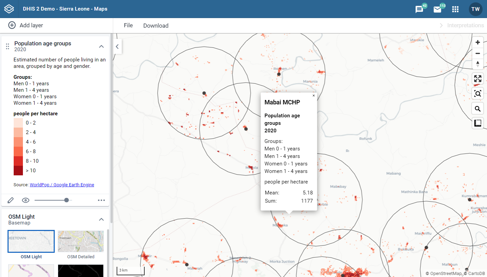
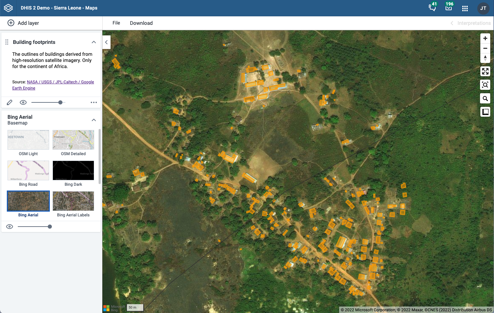
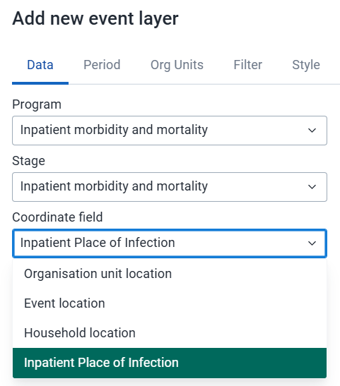
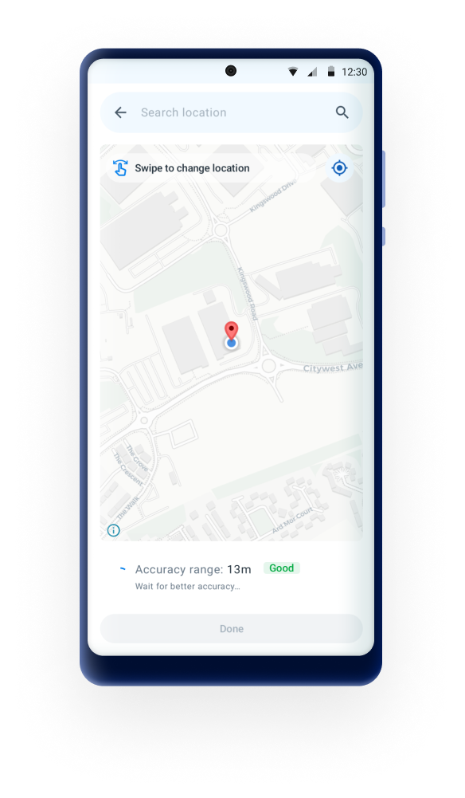
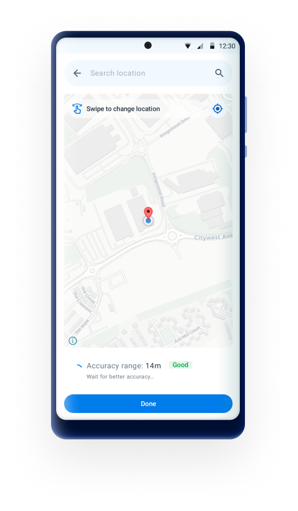
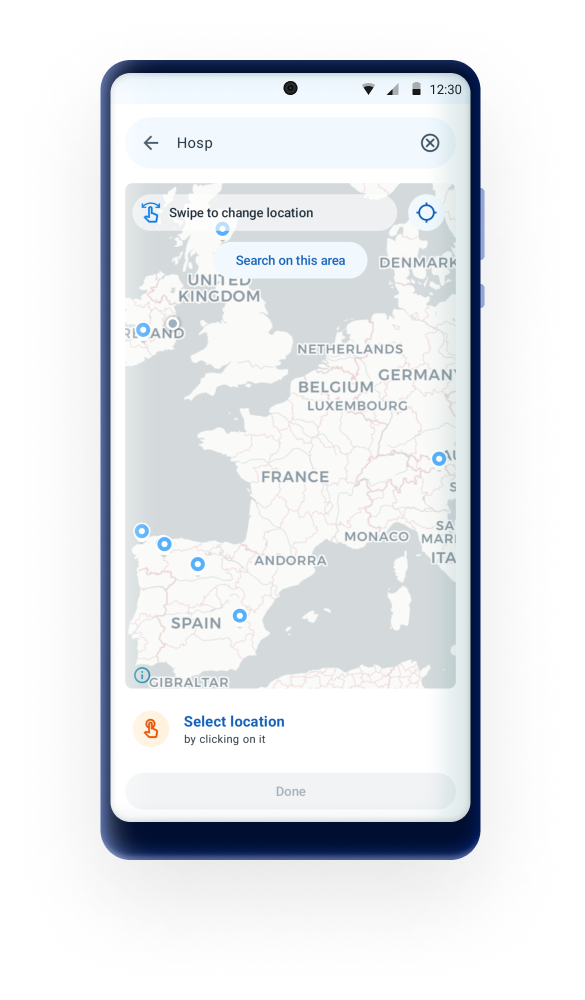
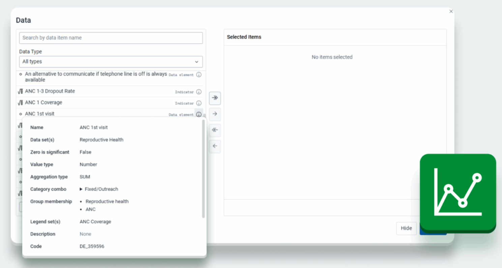
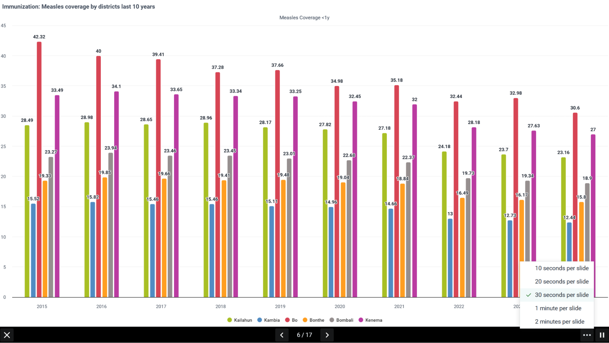
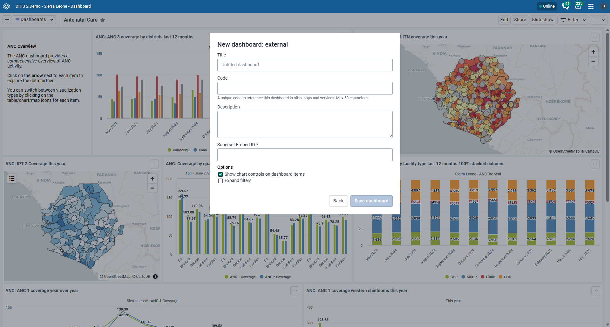
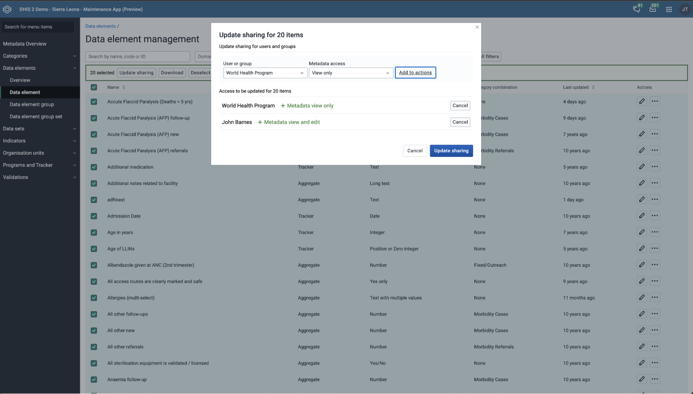

# DHIS2 features for health campaign use cases

## Functionality that supports geospatial analysis, target setting & campaign planning

Microplanning for health campaigns takes a bottom-up approach to creating a detailed operational plan for meeting campaign targets. This includes estimating and setting targets for the population the campaign intends to reach. One of the major challenges faced by health campaigns is the reliance on poor or outdated population estimates, which often leads to failure in achieving established healthcare goals. Without accurate information about where target populations are located, health campaigns are significantly hindered in their ability to achieve desired outcomes [Deardorff, 2018](https://doi.org/10.1371/journal.pntd.0006211). More precise population data can facilitate better cost forecasting and enable more accurate impact assessments for campaign-based interventions [WHO AFRO, 2009](https://apps.who.int/iris/bitstream/handle/10665/70450/WHO_IVB_09.11_eng.pdf?sequence=1&isAllowed=y)).

### Maps & geospatial analysis

DHIS2 provides a number of features and extensibility points that can support the comparison of various population data sources within or outside DHIS2, such as census data, household survey data, prior campaign data, Google Earth Engine layers, and WorldPop estimates. These data layers can be overlaid onto facility catchments to identify populations with limited geographic access to clinical services. Core DHIS2 functionalities include:

* [Users with Maps admin authority](https://docs.dhis2.org/en/use/user-guides/dhis-core-version-master/analysing-data/maps.html#maps_app_administrator) can add external map layers and select what sources are available to the users of the Maps app in DHIS2, such as population density and building/settlement footprints.

***Feature spotlight: Bringing external datasets into DHIS2 Maps***

Health campaigns often target specific age groups within a population. Detailed population estimates by age and gender can be used at your fingertips in DHIS2 by using resources such as [Grid3](https://grid3.org/) and [WorldPop](https://www.worldpop.org/) with Population and Population age groups layers.

### Google Earth Engine support

DHIS2 supports the import and visualization of Google Earth Engine layers in the Maps app, displaying these layers directly, without storing large datasets within the instance itself, which is useful for performance. For example, structure maps which are very useful in campaign planning can be imported into DHIS2 via **Google Earth Engine**. The dataset contains 516M building detections, across an area of 19.4M km2 (64% of the African continent).

### Harmonize external population estimates with local administrative units

The DHIS2 Import/Export app further supports the import of the underlying data sets from Google Earth Engine, enabling dynamic harmonization of the population data with DHIS2 org units and making the dataset available for additional calculations and analysis in DHIS2. This allows implementations to use the population data from Earth Engine in DHIS2 visualizations and combine it with other data sets as part of indicator expressions.

### Creating & storing catchment areas

DHIS2 does not have the functionality to create these catchment areas natively, but they can either be created by importing polygons as GeoJSON attributes or by creating it through third party services, for example the Crosscut app. These catchments can be registered as an “associated geometry” for organisation units and be used [instead of the org unit boundaries in the DHIS2 Maps app](https://docs.dhis2.org/en/use/user-guides/dhis-core-version-master/analysing-data/maps.html?h=#create-a-thematic-layer).

### Capturing and analyzing additional org unit  locations

In most cases, tracked entities or events in DHIS2 are registered to a specific organisation unit in the hierarchy, such as a facility or outreach site. For campaign planning, however, there are often important additional locations to capture — for example, where outreach teams are deployed, where services were actually delivered, or even the likely source of an infection that triggered a response. DHIS2 supports this through data elements and tracked entity attributes with the value type “organisation unit.” These allow campaign teams to record more than just the primary org unit of the event and link beneficiaries or services to other relevant sites.

These org unit values can be included as filters in line listings, making it possible, for example, to generate a list of all beneficiaries linked to a particular catchment facility. And when coordinates are configured for those referenced organisation units, (they can also be displayed in the Maps app)[https://docs.dhis2.org/en/use/user-guides/dhis-core-version-master/analysing-data/maps.html?h=#maps_create_event_layer], giving a clear picture of service delivery points beyond the static org unit hierarchy.

Learn more about the use of GIS and population mapping features with the following webinars:

* [Immunization webinar on microplanning solutions and innovations](https://www.youtube.com/watch?v=EjnxRxG5iHs)
* [Advanced population mapping](https://www.youtube.com/watch?v=DpQmOK4mYCA)
* [Data Use, Denominators and Immunization](https://community.dhis2.org/t/upcoming-webinars-on-data-use-denominators-and-immunization-in-english-et-en-francais/49491)

## Functionality that support field-based data collection

### Organizing interventions and work load with working lists

Within the Capture app, you can configure, save, and share working lists for [tracked entities](https://docs.dhis2.org/en/use/user-guides/dhis-core-version-master/tracking-individual-level-data/capture.html#custom-tei-working-list-for-programs-with-display-front-page-list-set-to-false), as well as events within a [program stage ](https://docs.dhis2.org/en/use/user-guides/dhis-core-version-master/tracking-individual-level-data/capture.html?h=program+stage+working+list+master+use#tracker-program-stage-working-list)or single event program. The lists allow you to filter, sort, and customize the columns, making it possible to create a tailored list for follow-up for each campaign field team for example by filtering by completion status, overdue events, or specific criteria (age group, geography, risk factors, etc.).

In addition to filtering and customizing lists, the Capture app supports bulk operations on enrollments and events. Users can select multiple records to complete or delete. With Tracker programs supporting user assignment per events, campaign interventions (events) can be assigned to each user, and working lists can be created accordingly with this filter, enabling clear view of workload during campaigns. These tools help ensure that campaign follow-up activities are timely, targeted, and coordinated.

### Capturing accurate GPS coordinates

Accurate geographic data is critical for planning, targeting, and monitoring health interventions, especially during campaigns. The DHIS2 Android Capture App allows field teams to collect high-quality GPS points and polygons (areas), even while offline. These features support better catchment area mapping, facility validation, and post-campaign analysis.

This functionality is available for tracked entities, such as when registering households or facilities, and for Events, such as capturing the site of a mobile vaccination team. It’s also available for form fields (Data Elements or Track Entity Attributes of value type Coordinate).

#### How accuracy is handled in the app

When a user opens a form with a coordinate, the app activates the device’s GPS and displays a visual indicator of accuracy. This gives users the chance to wait until the location lock reaches the defined precision before saving the data. If allowed, users can also open a map and manually select a location.

|  |  |  |
| -------- | ------- | -------- |
| Wait for precision | Confirm location | Manually select new location |

To further support data quality, the [Android Settings Web App (ASWA)](https://docs.dhis2.org/en/use/android-app/settings-configuration.html) allows administrators to configure two key parameters:

1. **Minimum Location Accuracy** – This defines the required GPS precision (in meters) before location data can be saved. For instance, setting this value to 10 means the app will block coordinate capture until the device reports a location within 10 meters of accuracy. The recommended minimum for field data collection is typically 5–20 meters, balancing reliability and usability. A stricter threshold (e.g. 5 meters) ensures high precision but may slow data entry, especially in areas with poor satellite reception. \

2. **Disable Manual Location Capture** – When this is enabled, users cannot adjust or select coordinates manually via the map interface. This option is particularly helpful when consistent, unbiased GPS data is needed for tasks like automated mapping or location-based validation. When disabled, the user can still open the map view, search or browse locations, and adjust points manually, depending on the program’s configuration. If the app is configured to block manual entry and the device cannot reach the minimum accuracy, no location will be captured.

#### Offline support

One of the major strengths of DHIS2 Android Capture is its full offline capability. Users can collect coordinates or polygons in the field without any connectivity. The data is stored locally and will be synced automatically once the device is back online. During this time, users can still search their local database and review captured locations.

Polygons and coordinates are stored as GeoJSON and can be exported via the DHIS2 API for further analysis in the Maps app or other GIS tools. This allows program managers to visualize data quality, assess spatial coverage, and integrate with other geographic datasets like Earth Engine and WorldPop.

However, there are some functional limitations that should be taken into account when designing and deploying campaign tools that rely on location data. Understanding these limitations will help implementers plan appropriate workflows, avoid confusion in the field, and identify where complementary tools or post-processing may be required. The following considerations highlight key aspects to keep in mind when working with geolocation features in offline or low-connectivity settings.

* Map backgrounds (tiles) are not cached by default.
    * If the user has not previously loaded the area in question while online, the map interface may appear blank. This does not affect coordinate capture via the device’s GPS, but it can limit the usability of the manual map view. Admins may consider pre-loading tiles in training or staging environments, or instructing users to open relevant maps while online ahead of field deployment.
* No real-time GPS tracking or breadcrumb trails.
    * While the app supports capturing one coordinate or geometry per entry (e.g., one point per event or one polygon per TEI), continuous location logging is not yet a feature.

## Functionality that support analysis & real time monitoring

### Monitoring progress through Data visualizer

The [Data Visualizer app](https://docs.dhis2.org/en/use/user-guides/dhis-core-version-master/analysing-data/data-visualizer.html#data_visualizer)  supports [cumulative](https://docs.dhis2.org/en/use/user-guides/dhis-core-version-master/analysing-data/data-visualizer.html?h=cumulative+values+use+master#list-of-available-options) values, trend and target-line features, which are helpful for tracking progress toward specific campaign goals.

By [disaggregating data by specific option sets](https://docs.dhis2.org/en/use/user-guides/dhis-core-version-master/analysing-data/data-visualizer.html#select-options-from-an-option-set) (e.g., age groups, gender, geographic location), campaigns can better understand which population segments are being reached and engaged. This helps identify gaps in coverage or areas needing intensified efforts. It is also beneficial for campaign teams that do not have access to create program indicators, for example for a specific option in the option set.

To understand the data used for monitoring, there is an information icon next to each data item in the selector in Data Visualizer. The information displayed depends on the item’s data type. Campaign teams can quickly access important details about each data item’s type and values, helping them determine if it’s suitable for their specific analytics needs. This immediate context ensures consistent use and interpretation of data items across reports, reducing errors and discrepancies. By providing clear information upfront, it also helps decision-makers interpret analytics and indicators more confidently, leading to better-informed campaign adjustments. Overall, it streamlines data exploration and validation, enabling faster, more accurate insights to guide campaign decisions.

### Real time monitoring with DHIS2 Dashboards

DHIS2 Dashboards natively support automated analyses to populate dashboards that display data for real-time monitoring. Users can export visualizations for use in presentations or reports, or just run a full-screen slideshow of the dashboard itself, enabling a continuous, ongoing display of campaign progress in for example national or sunational command centers.

Additionally, dashboards can be customized using **[custom dashboard plugins](https://developers.dhis2.org/docs/dashboard-plugins/developer/getting-started)**, adding dashboard items from apps built on the DHIS2 app platform.

In addition to the native dashboard functionality and extensibility such as plugins, from version 42, DHIS2 also supports[ displaying external dashboards through the Dashboard app](https://docs.dhis2.org/en/use/user-guides/dhis-core-version-master/analysing-data/dashboards.html#creating-and-editing-an-external-dashboard), with the frst supported external dashboard type is Superset. This allows dashboards served from other platforms to appear side-by-side with standard DHIS2 dashboards.

By integrating other BI tools like Superset, PowerBI and Tableau, users can create more advanced visualizations and integrate DHIS2 data with information from other systems. This flexibility is particularly useful when users require cross-cutting dashboards that draw from multiple data sources or need specific visual formats not available in the core DHIS2 dashboard module. These external tools can complement DHIS2 by supporting more advanced or large-scale reporting needs, while DHIS2 remains the central platform for operational data entry and decision-making.As we want DHIS2 to be this central repository of visualizing and analyzing data, making sure external dashboards can be visualized within DHIS2 itself is an important step.

### Advanced indicator calculations

#### Cumulative Over-Time Indicator Expression

The use of[ cumulative over-time aggregate indicators](https://docs.dhis2.org/en/use/user-guides/dhis-core-version-master/configuring-the-system/metadata.html#about_indicator) can be useful for cumulative coverage indicators or cumulative achievements toward campaign targets. This can be achieved using the `periodOffset` function in DHIS2 for versions 2.35.12 and above. Instead of annualizing indicators, coverage calculations can be based on the sum of the last 12 months, offering a more accurate assessment.

**Indicator Name:** Coverage (%) - Period Offset \
**Indicator ID:** lnC0fWd3sD4 \
**Numerator:** Total doses administered over the past 12 months

Expression: \
`Health Service Doses Given + Health Service Doses Given.periodOffset(-1) + Health Service Doses Given.periodOffset(-2) + ... + Health Service Doses Given.periodOffset(-11)`

**Denominator:** Target Population (e.g., live births, total eligible population) \
Expression: `GEN - Population live births`

By leveraging cumulative over-time indicators and the `periodOffset` function, health campaigns can achieve more precise and meaningful coverage calculations, ensuring better-informed decision-making and more effective interventions.

#### [Indicator Sub-Expressions](https://docs.dhis2.org/en/use/user-guides/dhis-core-version-master/configuring-the-system/metadata.html#indicator_subexpressions)

The indicator subExpression feature can be very useful in monitoring or evaluating campaigns at more granular levels before aggregation. You might want to count how many health facilities in a district administered more than a certain threshold of vaccine doses, bednets, interventions, rather than just summing all doses across the district. By using subExpression, you can evaluate each facility’s data individually, checking if their reported values exceed the threshold, and then aggregate these counts to see how many facilities met the target. This approach helps campaign managers identify coverage gaps, target underperforming sites, and allocate resources more effectively by focusing on the distribution of performance across facilities rather than just total numbers.

#### [Indicator Year-to-date Expressions](https://docs.dhis2.org/en/use/user-guides/dhis-core-version-master/configuring-the-system/metadata.html#indicator_yeartodate)

The year-to-date indicator expressions are especially valuable in campaigns for tracking progress over time against set targets. A campaign can use the yearToDate() function to sum all interventions given from the start of the year up to the current month, helping campaign managers see cumulative achievements rather than just monthly snapshots. This enables assessment of whether the campaign is on track or falling behind compared to the average performance or targets. Using [periodInYear] and [yearlyPeriodCount] allows flexible calculations of averages, differences, or proportional targets adjusted for different reporting periods (monthly, quarterly, weekly), providing a dynamic and accurate view of progress. This supports timely decision-making and resource allocation to ensure campaign goals are met effectively throughout the year.

Taken together, the DV app, dashboards, and advanced indicator functions provide a comprehensive toolkit for campaign monitoring. Campaign teams can track cumulative progress toward goals, compare current performance against past rounds or targets and  identify underperforming areas,y. Features like data definitions ensure that analytics are not only accurate but also widely understood and accessible, supporting better decision-making at all levels of a campaign.

### Functionality for system admins

#### Managing users & access in bulk

Managing secure user access across large-scale campaigns is challenging, particularly given the mobile nature of deployment teams and large volumes of users (hundreds or even thousands), the majority of which may not typically be responsible for routine DHIS2 data entry and analysis operations. need to rapidly create, modify or enable/disable hundreds or thousands or users.

Creating users

* The DHIS2 Web API can be useful for creating large batches of users by posting a JSON metadata payload to create users in bulk; however, admins must be cautious about handling of sensitive information like passwords
* [User invitations](https://docs.dhis2.org/en/develop/using-the-api/dhis-core-version-240/users.html#webapi_user_invitations) enable users can set their own passwords

Bulk sharing of objects to modify user access

* The new Maintenance app also supports bulk sharing through the UI
* The [bulk sharing API](http://docs.dhis2.org/en/develop/using-the-api/dhis-core-version-master/sharing.html#webapi_bulk_sharing) can also be utilized to update sharing settings to multiple metadata objects (e.g. to add or remove many users and user groups to many objects in one API operation)

### Exchanging campaign data with other DHIS2 instances

The [DHIS2 Data Exchange app](https://docs.dhis2.org/en/use/user-guides/dhis-core-version-master/exchanging-data/data-exchange.html?h=data+exchange+master#data_exchange) allows aggregated data to be transferred between DHIS2 instances, either manually on demand or on an automated schedule. For campaigns, this is especially valuable when activities are managed in a dedicated DHIS2 instance separate from the national HMIS. Throughout the campaign cycle or when the campaign concludes, summary results can be transferred automatically to the routine HMIS, ensuring they are included in national dashboards and reports. For example, coverage data from a measles immunization campaign can exchanged and shared with the HMIS as part of the national immunization dataset. This makes campaign results visible alongside routine immunization data, providing a complete picture of coverage and gaps.

By configuring scheduled data exchanges, health authorities reduce reporting delays and ensure that campaign achievements are integrated into routine monitoring in real time. This supports national decision-making, resource allocation, and donor reporting, while minimizing the reporting burden for campaign teams.

To implement this effectively, attention should be paid to metadata alignment between systems (org units, indicators, datasets), as well as the balance between detail vs. summary data. When well set up, the Data Exchange functionality can effectively bridges the gap between campaign systems and routine HMIS.

